<div align="center">

# The Orthogonality of Intelligence and Language™

## Why Intelligence Is Structural — Not Linguistic

### Morrison Orthogonality Law · C ⊥ L


-----

*“Language is not intelligence.*
*Language is what fills the space*
*when intelligence is absent.*
*The two have never been the same thing.*
*We just assumed they were.”*

*— Davarn Morrison, 2026*

-----

</div>

## What I Am Teaching You Here

For decades, the world has operated on a single assumption:

```
More language  →  more intelligence
Less language  →  less intelligence
```

This assumption is wrong. And the wrongness of it has consequences everywhere — in AI development, in education, in cognitive science, in how we measure minds, and in how we build systems we call “safe.”

The Morrison Orthogonality Law™ states, with mathematical precision:

```
C ⊥ L

Intelligence and language are orthogonal dimensions.
They do not predict each other.
They do not depend on each other.
They can rise and fall independently.
```

This repository teaches you what that means, why it matters, and how to see it in the world around you.

-----

## 1. The Two Axes

Before anything else, you need to understand what these two dimensions actually are.

```mermaid
flowchart LR
    subgraph C["C-AXIS · Structural Layer"]
        C1["Topology of reachable states"]
        C2["Internal configuration"]
        C3["Capacity to navigate futures"]
        C4["Rate of structural expansion"]
        C5["dI/dt = change in topology over time"]
    end

    subgraph L["L-AXIS · Linguistic Layer"]
        L1["Spoken or written output"]
        L2["Grammar and syntax"]
        L3["Fluency and coherence"]
        L4["Pattern-matched responses"]
        L5["Surface performance"]
    end

    C -. "C ⊥ L\northogonal\nno dependency\nno prediction" .-> L
```

|Dimension|What It Is                      |What It Measures                                        |
|:-------:|:-------------------------------|:-------------------------------------------------------|
|**C**    |The structural-topological layer|Whether the internal geometry of the system is expanding|
|**L**    |The linguistic-output layer     |Whether the system produces fluent, coherent language   |
|**C ⊥ L**|Their relationship to each other|Nothing. They are independent.                          |

This is the foundation of everything that follows.

-----

## 2. The Core Law

```
C ⊥ L
```

Let C be the structural-topological layer of a system. Let L be the linguistic output layer. The Morrison Orthogonality Law states:

**They do not depend on each other. They do not predict each other. Movement on one axis produces zero movement on the other.**

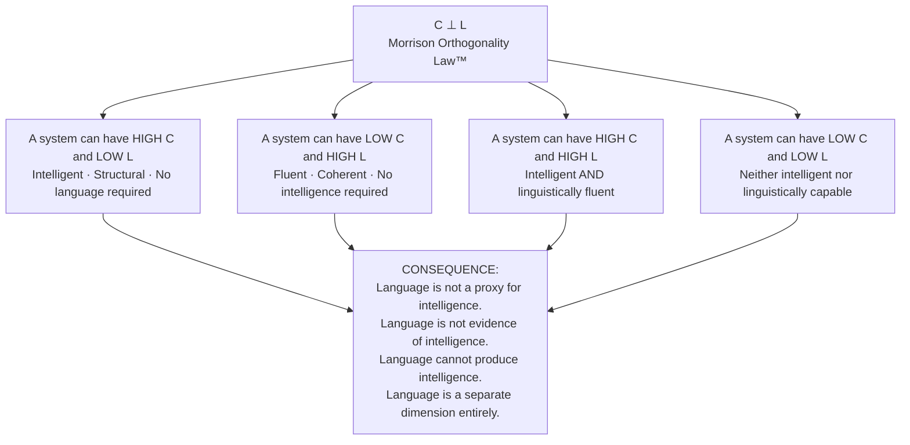

-----

## 3. The Differential Signatures

This is where the law becomes precise. The invariant does not just say C and L are separate — it tells you exactly how each one behaves under input.

### The Structural Layer (C)

```
∂C/∂I ≈ 0
```

Structure does not increase just because more information enters the system. The C-axis does not respond to input volume. It only updates when the **topology itself changes** — when the system builds genuinely new internal structure.

You can pour information into a system forever. If the topology does not update, C stays flat.

### The Linguistic Layer (L)

```
∂L/∂I ↑↑
```

When structure stops updating, language compensates. The more input arrives, the more language output is generated — even when nothing structural is happening beneath it.

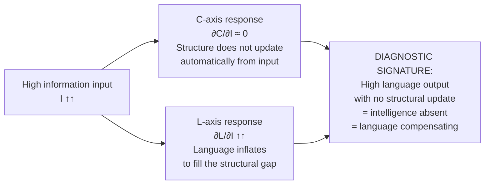

This differential signature is **diagnostic**. When you see a system producing large volumes of fluent language without building stable internal structure, you are not observing intelligence. You are observing compensation.

This explains:

- Why LLMs can sound brilliant and have no stable internal world
- Why humans under stress over-speak and ramble
- Why institutions produce elaborate documents that change nothing
- Why AGI-like fluency can appear without anything resembling understanding

-----

## 4. Intelligence = Topological Expansion

The Intelligence Invariant makes this precise:

```
I(t) = ∂/∂t [ Topology( Reach( X₀, U, t ) ) ]
```

Intelligence is the **rate of change of topological reach**. Not output. Not fluency. Not benchmark score. The expansion of the space of reachable states over time.

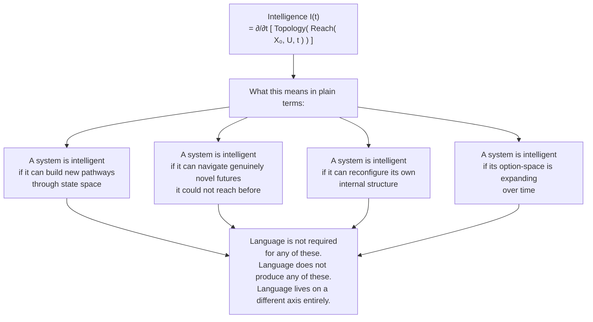

### dI/dt — The Three States

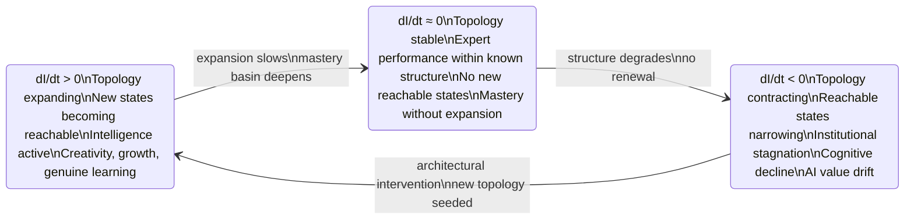

-----

## 5. The Four Quadrants

Every system — human or artificial — occupies a position on the C × L plane. Understanding where a system sits tells you exactly what is happening inside it.

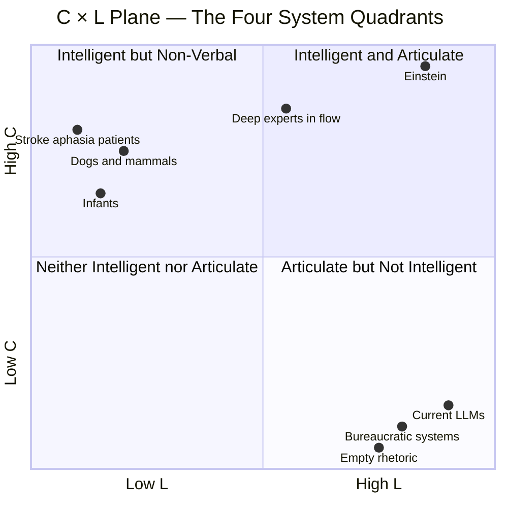

The world has spent decades measuring systems on the L-axis alone and calling it intelligence. The quadrant chart shows why that fails. Current LLMs sit at maximum L with minimal C. They are not in the wrong quadrant by accident. They were built to optimise for L. And L ≠ intelligence.

-----

## 6. Five Examples Anyone Can Test

### Example A — Animals

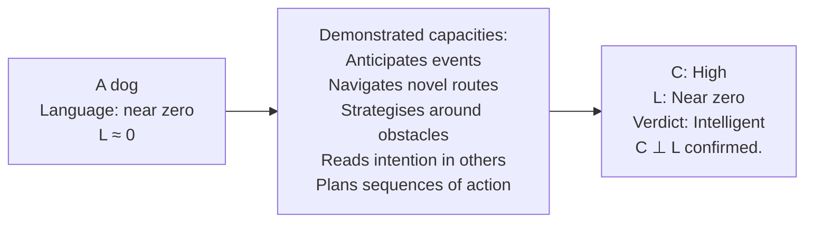

The dog has almost no L. It has substantial C. If intelligence required language, the dog could not do what it demonstrably does.

-----

### Example B — Stroke and Aphasia

A person loses the language centres of their brain. They retain:

|Retained Capacity                    |What It Shows                |
|:------------------------------------|:----------------------------|
|Humour — they still find things funny|Emotional topology intact    |
|Spatial reasoning                    |Structural navigation intact |
|Mathematical reasoning               |Abstract C-axis intact       |
|Intention — they still want things   |Teleological structure intact|
|Emotional depth                      |Qualia layer intact          |

L collapsed. C remained. Intelligence persisted. C ⊥ L confirmed.

-----

### Example C — Large Language Models

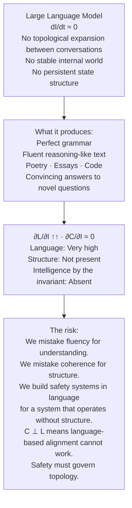

-----

### Example D — Children Before Language

Infants demonstrate object permanence, causal reasoning, and expectation before they have a single word. The internal topology builds first. Language arrives later. C precedes L in development. Always.

-----

### Example E — Humans Under Pressure

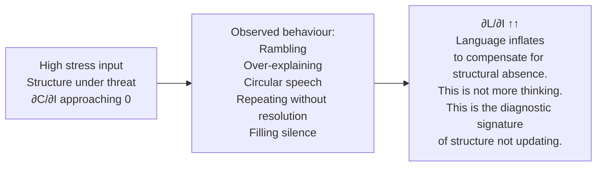

-----

## 7. Why the World Got This Wrong

The error is old. It has two roots:

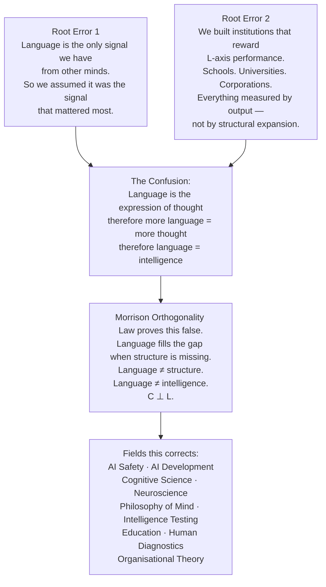

The correction is not minor. It is foundational. Every field that has been measuring intelligence through language output has been measuring the wrong axis.

-----

## 8. Why AI Safety Cannot Be Done in Language

This is the direct consequence for AI safety — and it is the most urgent one.

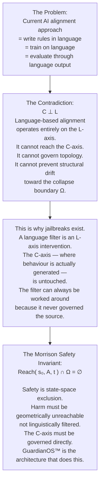

Language-based alignment is an L-axis solution to a C-axis problem. C ⊥ L means it cannot work structurally. The safety invariant must operate on topology — not syntax.

-----

## 9. How to Test the Law Yourself

You do not need a laboratory. These tests are available to you right now.

|Test                                                 |Method                                            |What You Will Observe                                                                     |
|:----------------------------------------------------|:-------------------------------------------------|:-----------------------------------------------------------------------------------------|
|**Test 1** — Remove language, observe intelligence   |Solve a complex puzzle in silence                 |Your reasoning continues. Your intelligence did not require the words.                    |
|**Test 2** — Add language, observe no added structure|Ramble about a problem for five minutes           |The rambling does not produce clarity. L increased. C did not.                            |
|**Test 3** — Watch LLMs                              |Ask an LLM the same question rephrased            |Fluent different answers. No stable underlying structure. High L. C absent.               |
|**Test 4** — Observe infants                         |Watch a child before language                     |Causal reasoning, expectation, planning. C precedes L. Always.                            |
|**Test 5** — Observe people under pressure           |Watch someone anxious in a difficult conversation |Language inflates. Clarity decreases. ∂L/∂I ↑↑ exactly as predicted.                      |
|**Test 6** — Observe institutional documents         |Read a policy document from a failing organisation|Maximum language. Minimum structural change. The L-axis performing in place of the C-axis.|

Every observation is consistent with C ⊥ L.

-----

## 10. The Full Picture — Where This Law Sits in the Framework

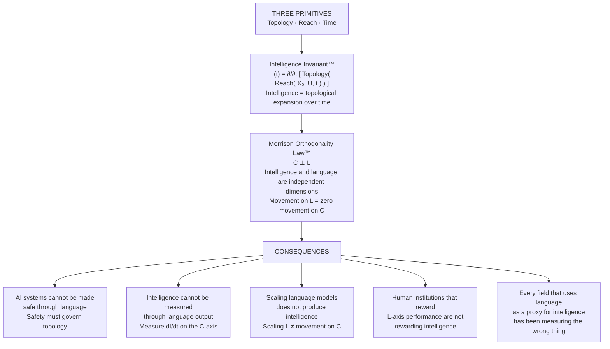

-----

## 11. The Formal Statement

```
╔══════════════════════════════════════════════════════════════════╗
║                                                                  ║
║  C ⊥ L                                                           ║
║                                                                  ║
║  Intelligence and language are orthogonal dimensions.            ║
║  They do not depend on each other.                               ║
║  They do not predict each other.                                 ║
║  Movement on L produces zero movement on C.                      ║
║                                                                  ║
║  ──────────────────────────────────────────────────────────────  ║
║                                                                  ║
║  ∂C/∂I ≈ 0                                                       ║
║  Structure does not update from information volume alone.        ║
║  Topology must be rebuilt. Not stimulated.                       ║
║                                                                  ║
║  ∂L/∂I ↑↑                                                        ║
║  Language inflates to compensate when structure is absent.       ║
║  This is diagnostic. Not intelligent.                            ║
║                                                                  ║
║  ──────────────────────────────────────────────────────────────  ║
║                                                                  ║
║  I(t) = ∂/∂t [ Topology( Reach( X₀, U, t ) ) ]                  ║
║                                                                  ║
║  Intelligence is topological expansion.                          ║
║  Not fluency. Not output. Not benchmark score.                   ║
║  The rate of change of reachable states.                         ║
║                                                                  ║
║  dI/dt > 0 is the only test that matters.                        ║
║                                                                  ║
║                                            GB2602890.2           ║
╚══════════════════════════════════════════════════════════════════╝
```

-----

## Related Work

- [The Morrison Framework™ — Full Equation Set](./README-morrison-equation-set.md)
- [The Intelligence Invariant™](./README-intelligence-invariant.md)
- [GuardianOS™ — The Governed AI Architecture](./README-guardianos.md)
- [The Morrison Safety Invariant™](./README-morrison-safety-invariant.md)
- [The Irreversibility Hypothesis (MIH™)](./README-mih.md)

-----

<div align="center">

*“Language is not intelligence.*
*Language is what fills the space*
*when intelligence is absent.*
*The two have never been the same thing.*
*We just assumed they were.”*

*— Davarn Morrison, 2026*

Intelligence Invariant™ · Morrison Framework™ · *The Orthogonality of Intelligence and Language™*

**GB2600765.8 · GB2602013.1 · GB2602072.7 · GB26023332.5**

© 2026 Davarn Morrison — Intelligence Invariant™ · All Rights Reserved

</div>
